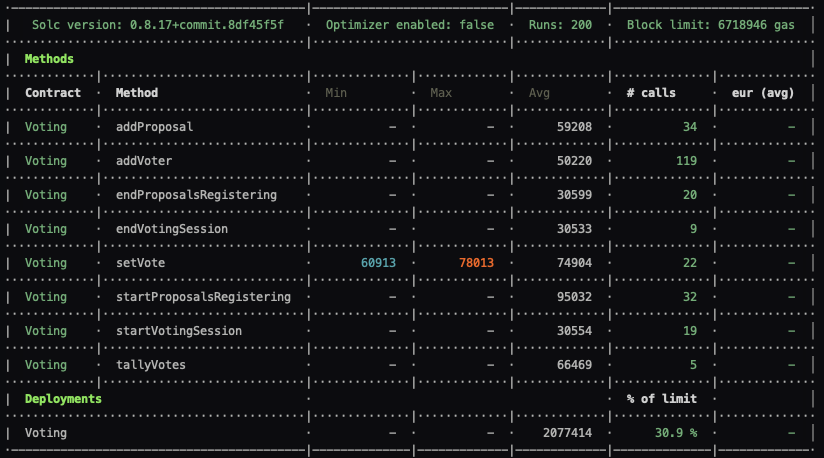

# Projet 2 : Tests du contrat Voting.sol

## Run tests

```bash
cd 2_Tests/
truffle test
```

ou

```bash
cd 2_Tests/
npm test
```

## eth-gas-reporter



## Tests

Les tests sont organisés par `workflowStatus`. Chaque étape du `workflowStatus` correspond à un `describe`. Pour chaque `workflowStatus`, est vérifié : les events, les fonctions associées au status, les `require` et les droits d'utilisations (`modifier`).

### État initial

- Vérification de l'état initial du contrat
  - Variables.
  - `workflowStatus` par défaut.
  - Revert des fonctions principales en tant qu'owner.

| Name                                        | Test                      | Expect/ExpectRevert/ExpectEvent |
| ------------------------------------------- | ------------------------- | ------------------------------- |
| \_owner is contract owner                   | owner                     | expect                          |
| RegisteringVoters is default workflowStatus | workflowStatus            | expect                          |
| addProposal() should revert                 | addProposal()             | expectRevert                    |
| setVote() should revert                     | setVote()                 | expectRevert                    |
| endProposalsRegistering() should revert     | endProposalsRegistering() | expectRevert                    |
| startVotingSession() should revert          | startVotingSession()      | expectRevert                    |
| endVotingSession() should revert            | endVotingSession()        | expectRevert                    |
| tallyVotes() should revert                  | tallyVotes()              | expectRevert                    |

### RegisteringVoters

Vérification des events, `require` et fonctions liées à la phase d'enregistrement des votants.

| Name                                         | Test            | Expect/ExpectRevert/ExpectEvent |
| -------------------------------------------- | --------------- | ------------------------------- |
| addVoter() should emit VoterRegistered event | VoterRegistered | expectEvent                     |
| \_owner can addVoter()                       | addVoter()      | expect                          |
| check voter struct after register            | addVoter()      | expect                          |
| \_notVoter can not use getVoter              | addVoter()      | expectRevert                    |
| only \_owner can add a voter                 | addVoter()      | expectRevert                    |
| can't register two time a voter              | addVoter()      | expectRevert                    |

### ProposalsRegistrationStarted

Vérification des events, `require` et fonctions liées à la phase d'enregistrement des propositions.

| Name                                                               | Test                        | Expect/ExpectRevert/ExpectEvent |
| ------------------------------------------------------------------ | --------------------------- | ------------------------------- |
| startProposalsRegistering() should emit WorkflowStatusChange event | WorkflowStatusChange        | expectEvent                     |
| startProposalsRegistering() should change workflowStatus           | workflowStatus              | expect                          |
| should emit ProposalRegistered event                               | ProposalRegistered          | expectEvent                     |
| only owner can startProposalsRegistering()                         | startProposalsRegistering() | expectRevert                    |

- `beforeEach`
  - Ajout de `_owner`, `_voter1`, `_voter2` et `_voter3` en tant que voters.
  - Passage au `workflowStatus.ProposalsRegistrationStarted`.

| Name                                  | Test          | Expect/ExpectRevert/ExpectEvent |
| ------------------------------------- | ------------- | ------------------------------- |
| \_voter1 can add a proposal           | addProposal() | expect                          |
| \_voter1 can add multiple proposals   | addProposal() | expect                          |
| \_notVoter can not use getOneProposal | addProposal() | expectRevert                    |
| \_notVoter can't add a proposal       | addProposal() | expectRevert                    |
| proposal can not be empty             | addProposal() | expectRevert                    |
| proposal[0] should be the genesis     | addProposal() | expect                          |

### ProposalsRegistrationEnded

Vérification des events, `require` et fonctions lorseque la phase d'enregistrement des propositions est terminée.

- `beforeEach`
  - Ajout de `_owner`, `_voter1`, `_voter2` et `_voter3` en tant que voters.
  - Passage au `workflowStatus.ProposalsRegistrationStarted`.
  - Ajout de `_proposal1` via `·addProposal()`.

| Name                                                             | Test                      | Expect/ExpectRevert/ExpectEvent |
| ---------------------------------------------------------------- | ------------------------- | ------------------------------- |
| endProposalsRegistering() should emit WorkflowStatusChange event | WorkflowStatusChange      | expectEvent                     |
| endProposalsRegistering() should change workflowStatus           | workflowStatus            | expect                          |
| only owner can endProposalsRegistering()                         | endProposalsRegistering() | expectRevert                    |

### VotingSessionStarted

Vérification des events, `require` et fonctions lorseque la phase de vote commence.

- `beforeEach`
  - Ajout de `_owner`, `_voter1`, `_voter2` et `_voter3` en tant que voters.
  - Passage au `workflowStatus.ProposalsRegistrationStarted`.
  - Ajout de `_proposal1` via `·addProposal()`.
  - Passage au `workflowStatus.ProposalsRegistrationEnded`.

| Name                                                        | Test                 | Expect/ExpectRevert/ExpectEvent |
| ----------------------------------------------------------- | -------------------- | ------------------------------- |
| startVotingSession() should emit WorkflowStatusChange event | WorkflowStatusChange | expectEvent                     |
| startVotingSession() should change workflowStatus           | workflowStatus       | expect                          |
| only owner can startVotingSession()                         | startVotingSession() | expectRevert                    |

- `beforeEach`
  - Ajout de `_owner`, `_voter1`, `_voter2` et `_voter3` en tant que voters.
  - Passage au `workflowStatus.ProposalsRegistrationStarted`.
  - Ajout de `_proposal1` via `·addProposal()`.
  - Passage au `workflowStatus.ProposalsRegistrationEnded`.
  - Passage au `workflowStatus.VotingSessionStarted`.

| Name                                 | Test      | Expect/ExpectRevert/ExpectEvent |
| ------------------------------------ | --------- | ------------------------------- |
| \_voter1 can vote for proposal 1     | setVote() | expect                          |
| \_voter1.hasVoted is true after vote | setVote() | expect                          |
| Can't vote twice                     | setVote() | expectRevert                    |
| revert on undefined proposal         | setVote() | expectRevert                    |
| \_notVoter can not setVote()         | setVote() | expectRevert                    |

### VotingSessionEnded

Vérification des events, `require` et fonctions lorseque la phase de vote est terminée.

- `beforeEach`
  - Ajout de `_owner`, `_voter1`, `_voter2` et `_voter3` en tant que voters.
  - Passage au `workflowStatus.ProposalsRegistrationStarted`.
  - Ajout de `_proposal1` via `·addProposal()`.
  - Passage au `workflowStatus.ProposalsRegistrationEnded`.
  - Passage au `workflowStatus.VotingSessionStarted`.

| Name                                                    | Test                 | Expect/ExpectRevert/ExpectEvent |
| ------------------------------------------------------- | -------------------- | ------------------------------- |
| endVotingSession should emit WorkflowStatusChange event | WorkflowStatusChange | expectEvent                     |
| endVotingSession should change workflowStatus           | workflowStatus       | expect                          |
| only owner can endVotingSession()                       | endVotingSession()   | expectRevert                    |

### VotesTallied

Vérification des events, `require` et fonctions lors de la phase de comptage des votes.

- `beforeEach`
  - Ajout de `_owner`, `_voter1`, `_voter2` et `_voter3` en tant que voters.
  - Passage au `workflowStatus.ProposalsRegistrationStarted`.
  - Ajout de `_proposal1`, `_proposal2`, `_proposal3`· via `·addProposal()`.
  - Passage au `workflowStatus.ProposalsRegistrationEnded`.
  - Passage au `workflowStatus.VotingSessionStarted`.
  - `_owner` et `_voter1` votent pour `_proposal1` via `setVote()`.
  - `_voter2` vote pour `_proposal2` via `setVote()`.
  - `_voter3` vote pour `_proposal3` via `setVote()`.
  - Passage au `workflowStatus.VotingSessionEnded`.

| Name                                                                 | Test                 | Expect/ExpectRevert/ExpectEvent |
| -------------------------------------------------------------------- | -------------------- | ------------------------------- |
| tallyVotes should emit WorkflowStatusChange.VotesTallied event       | WorkflowStatusChange | expectEvent                     |
| tallyVotes should change workflowStatus                              | workflowStatus       | expect                          |
| only owner can tallyVotes()                                          | tallyVotes()         | expectRevert                    |
| tallyVotes should update winningProposalID with the winning proposal | winningProposalID    | expect                          |
